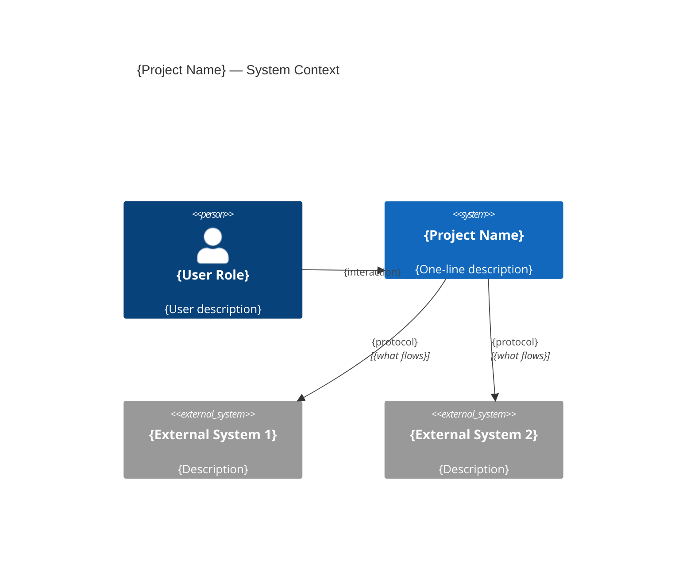
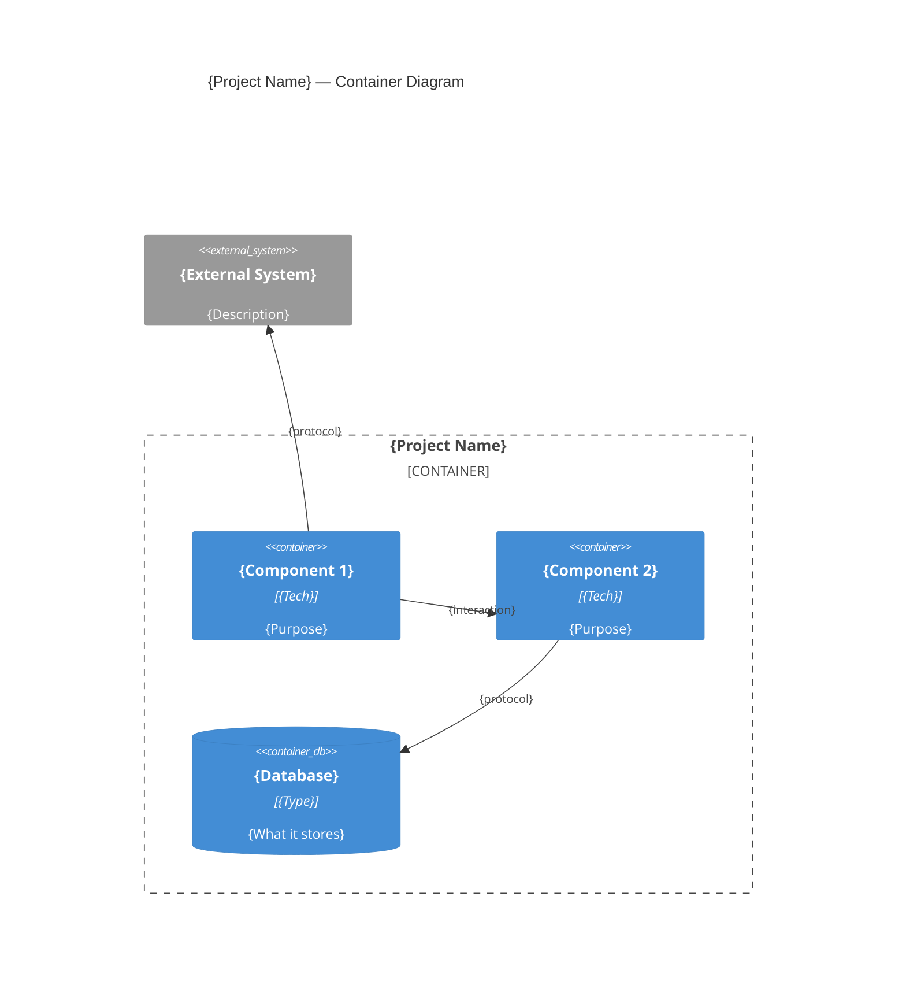
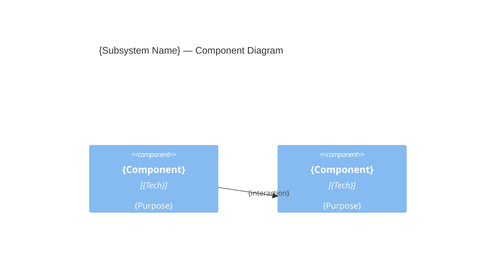
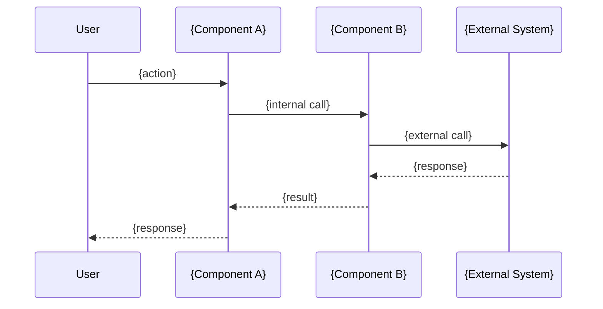
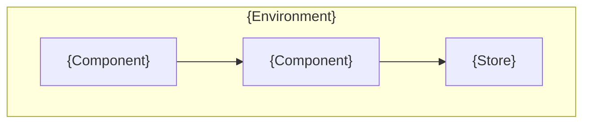
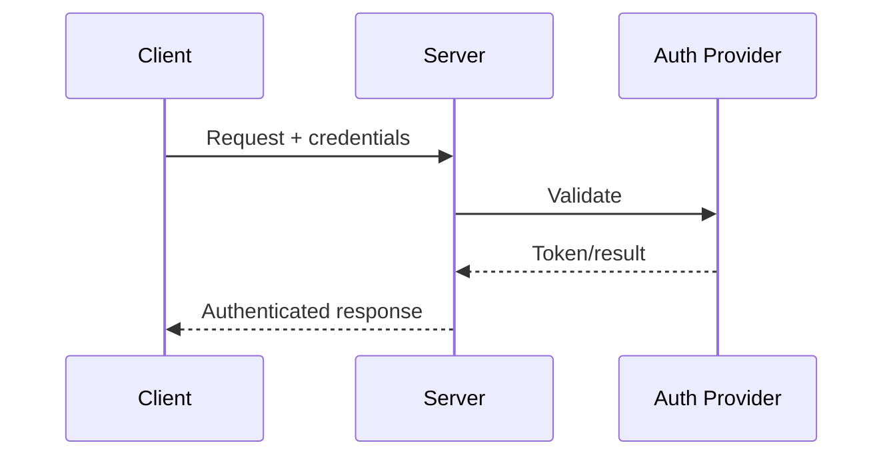

# {Project Name} Architecture

**Version**: 1.0.0-draft
**Status**: Draft
**Last Updated**: {date}

This document provides a visual and structural overview of the {project name} system. For the full technical specification, see [SPEC.md](SPEC.md).

---

## Table of Contents

1. [System Overview](#1-system-overview)
2. [Component Diagrams](#2-component-diagrams)
3. [Module Decomposition](#3-module-decomposition)
4. [Data Flow Diagrams](#4-data-flow-diagrams)
5. [Storage Architecture](#5-storage-architecture)
6. [Deployment Model](#6-deployment-model)
7. [Network Topology](#7-network-topology)
8. [Security Architecture](#8-security-architecture)

---

## 1. System Overview

### Design Philosophy

<!-- 3-5 principles that drove every architectural decision. -->

{Project name} is built around these principles:

1. **{Principle 1}**: {explanation}
2. **{Principle 2}**: {explanation}
3. **{Principle 3}**: {explanation}

### System Constraints

| Constraint | Impact on Architecture |
|-----------|----------------------|
| {constraint} | {how it shapes the design} |

---

## 2. Component Diagrams

### 2.1 C4 Context Diagram

Shows {project name} in relation to all external systems.

### 2.2 C4 Container Diagram

Zooms into {project name} to show its internal containers.

### 2.3 C4 Component Diagram (optional — for complex subsystems)

---

## 3. Module Decomposition

| Module | Purpose | Key Dependencies | SPEC Reference |
|--------|---------|-----------------|----------------|
| {module} | {purpose} | {deps} | Section {N} |

---

## 4. Data Flow Diagrams

### 4.1 {Primary Flow} (e.g., "User Request Lifecycle")

### 4.2 {Secondary Flow}

<!-- Add as many flows as needed to cover the major paths through the system. -->

---

## 5. Storage Architecture

### 5.1 Overview

<!-- Which stores exist, what they hold, why they were chosen. -->

### 5.2 Schema Summary

<!-- Key tables/collections/buckets — not full DDL, just enough to understand the data model. Full schema is in SPEC.md. -->

| Store | Entity | Key Fields | Purpose |
|-------|--------|-----------|---------|
| {store} | {entity} | {fields} | {purpose} |

---

## 6. Deployment Model

### 6.1 Deployment Diagram

### 6.2 Infrastructure Requirements

| Resource | Requirement | Notes |
|----------|-------------|-------|
| {resource} | {spec} | {notes} |

---

## 7. Network Topology

<!-- How components communicate. Protocols, ports, TLS, etc. -->

---

## 8. Security Architecture

### 8.1 Trust Boundaries

<!-- Where trust boundaries exist in the system. What crosses them. -->

### 8.2 Authentication Flow

### 8.3 Data Encryption

| Data | At Rest | In Transit |
|------|---------|-----------|
| {data type} | {method} | {method} |
